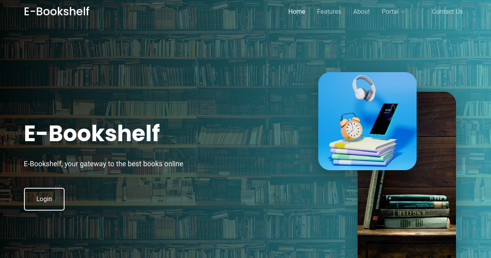

  

<h3 align="center">E-Bookshelf</h3>

 E-Bookshelf is an electronic bookshelf for online readers, it is a free software to get all kinds of books available.
      

## 📝 Table of Contents

- [About](#about)
- [Getting Started](#getting_started)
- [Usage](#usage)
- [Style](#style)
- [TODO](../TODO.md)
- [Contributing](../CONTRIBUTING.md)
- [Authors](#authors)
- [Acknowledgments](#acknowledgement)

## 🧐 About 

E-Bookshelf (Electronic Bookshelf) is a digital library where readers can find books to read. With thousands of free books, you can easily explore new authors and genre on any device anytime and anywhere. Search through the categories to find the perfect Ebook for you..

## 🏁 Getting Started 

The project is available on the project website. To access free books on E-Bookshelf, visit [Project Website](http://procodes.tech), create an account and enjoy.

### Prerequisites

To access the books on the website, you do not have to install anything, just have access to the internet and visit the project url from your browser.  
To contribute to this project, create a pull request, make your contribution and push to a new branch.

### Installing

To run this project locally, 
- Install PHP
- Install a local server for the Database
- Create your database, set the password and username
- Request for the DB File from the project team lead
- Import the database to your local engine and try logging in

## 🔧 Coding Style

For this project, ensure you adhere to the coding style as it is, 
you can install HTML in PHP formatter to automatically format your code
to look good. 

## 🎈 Usage 

Login to the project website and enjoy free E-Books. Free login details can be gotten from [Here](http://procodes.tech/login)

## ⛏️ Built Using 

- [MySQL](https://www.mongodb.com/) - Database
- [Javascript](https://js.org/) - Frontend
- [HTML](http://html5up.org/) - App Structure
- [Bootstrap] (https://getbootstrap.com/) - Styling
- [PHP](https://php.net/) - Server Environment

## ✍️ Authors 

- [@Mauryn7](https://github.com/Mauryn7) - Frontend Engineer
- [@collinsoden22](https://github.com/collinsoden22) - Backend Engineer
- [@ifelolla](https://github.com/ifelolla) - Frontend Engineer

See also the list of [contributors](https://github.com/Collinsoden22/E-Bookshelf/contributors) who participated in this project.

## 🎉 Acknowledgements 

- The project manager sincerely appreciates everyone who participated in building this project.
- Though the time frame for the project was short, everyone worked very hard to ensure this project is a success and this means a lot to us and the world. Thank you for being part of the development of the human race by building a tool that can help us all grow.